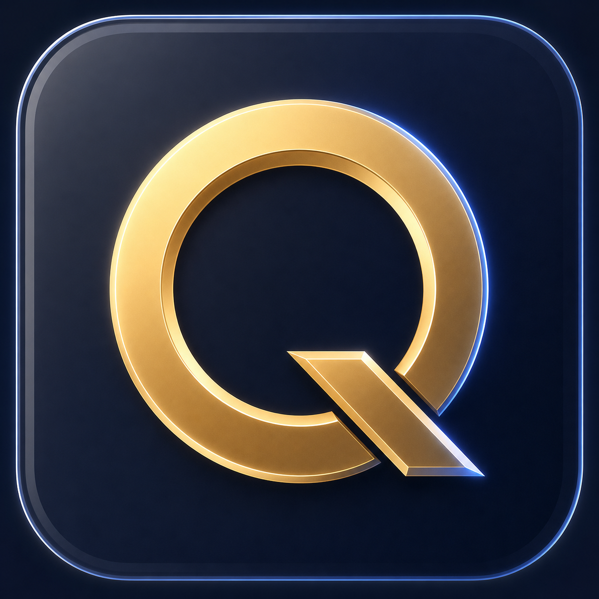

<p align="center">
  
</p>

<h1 align="center">onQ</h1>

<p align="center">
  <b>Quick Prompt - a search-oriented encrypted prompt vault built for speed, ownership, and local control.</b>
  <br />
  Win+Q / Meta+Q / ⌘+Q quick access · system tray · Markdown vaults · password or keychain encryption · hybrid search · local embeddings
</p>

<p align="center">
  <a href="https://github.com/visorcraft/onQ/releases/latest"></a>
  
  
  
  
</p>

---

## Why onQ

Prompt libraries should be as fast as Spotlight and as portable as a folder.
onQ keeps prompts in readable Markdown files, builds an encrypted local
search index, and stays one recorded shortcut away.

No hosted account is required. Your vault can live anywhere you already sync
files, including Git, Dropbox, iCloud, or Syncthing.

## Features

| Surface | What it does |
|---|---|
| **Quick access** | Opens with **Win+Q** (Windows), **Meta+Q** (Linux), or **⌘+Q** (macOS), or a user-recorded global shortcut, including while hidden in the system tray |
| **Hybrid search** | Fuses sparse keyword and vector similarity results with Reciprocal Rank Fusion |
| **Markdown vault** | Keeps prompts as portable `.md` files with YAML frontmatter |
| **Encryption** | Protects the local index with either a master password or an app-generated key stored in the OS keychain |
| **Recovery** | Gives passwordless vaults a 24-word recovery phrase for restoring their generated key |
| **Prompt locks** | Encrypts selected prompt bodies with separate per-prompt keys |
| **Smart organization** | Supports tags, folders, smart folders, saved searches, and local AI tag suggestions |
| **Sync resilience** | Watches external edits, keeps history, and surfaces three-way merge conflicts |
| **Plugins** | Loads signed Rust-native plugins through a versioned C ABI |

## Prerequisites

- Node.js **24+**
- Rust **stable**
- Platform dependencies from the [Tauri prerequisites](https://v2.tauri.app/start/prerequisites/)

```bash
git clone https://github.com/visorcraft/onQ
cd onQ
```

`mongreldb-core` is pulled from crates.io via `Cargo.toml` — no sibling clone.

## Develop

```bash
npm install
npm run dev:app
```

## Build

```bash
npm run build:app
```

Bundles are written under `target/release/bundle/`.

## Vault protection

### Master password

The password derives the vault encryption key and is never stored. onQ
asks for it whenever the vault needs to be unlocked.

### System keychain

onQ can generate the encryption key and store it in macOS Keychain,
Windows Credential Manager, or the Linux secret service. This mode provides a
24-word recovery phrase during vault creation. The phrase is only used to
restore the generated key.

## Architecture

```text
src/                         Svelte 5 desktop UI
crates/
  onq-app/               Tauri shell, commands, tray, global shortcut
  onq-core/              vault, crypto, search, sync, history, plugins
  onq-plugin-sdk/        versioned native plugin ABI
  onq-test-utils/        shared Rust test fixtures
docs-site/                   VitePress documentation
```

Core stack:

```text
Tauri 2 + Svelte 5 + TypeScript
Rust + Tokio
MongrelDB encrypted local index
MiniLM 384-dimensional local embeddings
```

## Status

onQ is pre-alpha. Storage formats and APIs may change before `1.0`.

## License

GPL-3.0-only. See [LICENSE](LICENSE).
